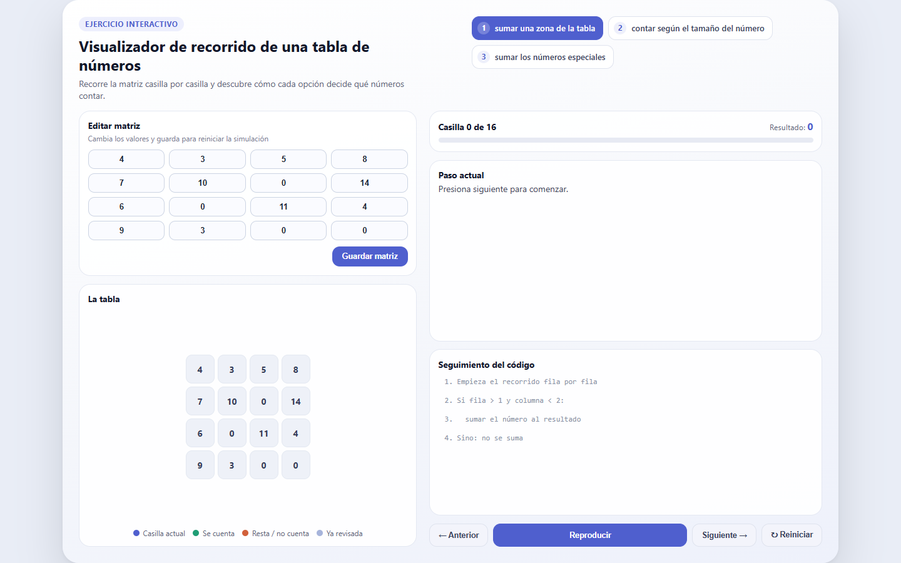
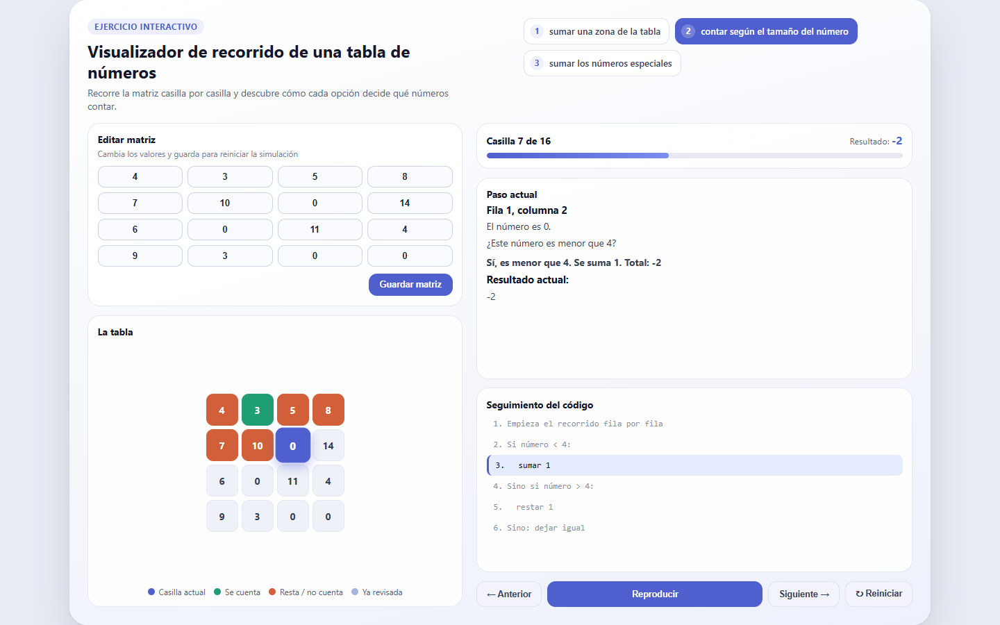
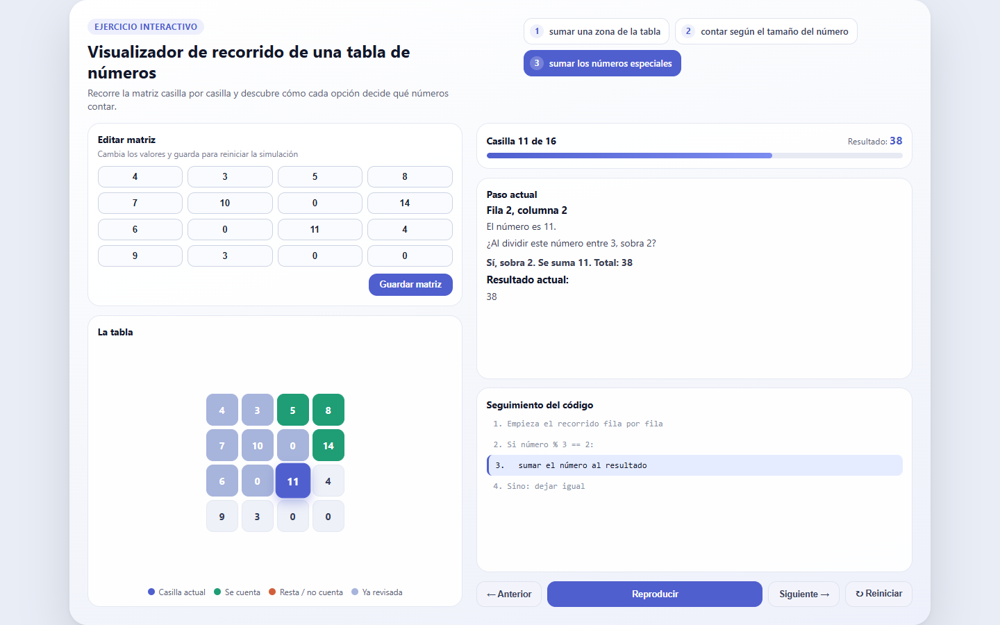

# Visualizador de recorrido de una tabla de números

Aplicación web educativa que muestra, **paso a paso**, cómo un programa recorre una matriz de 4x4 y decide qué números contar según la regla que elijas. Pensada para enseñar de forma visual conceptos de recorrido de matrices, condicionales y acumuladores sin usar jerga técnica.



## Qué hace

La app recorre una tabla de números fila por fila, columna por columna, y en cada casilla evalúa una de tres reglas:

| Opción | Regla | Qué hace |
|---|---|---|
| **1** | Sumar una zona de la tabla | Si la casilla está en las filas 2-3 y columnas 0-1, se suma su valor al resultado. |
| **2** | Contar según el tamaño del número | Si el número es menor que 4 se suma 1; si es mayor que 4 se resta 1; si es igual a 4 no cambia nada. |
| **3** | Sumar los números especiales | Si el número deja residuo 2 al dividirlo entre 3, se suma su valor al resultado. |

Por cada casilla se muestra:
- La fila y columna que se está revisando y el número que contiene.
- La pregunta que el código se hace en ese momento (explicada en lenguaje simple).
- El resultado acumulado hasta ese punto.
- La línea de "pseudo-código" equivalente que se está ejecutando, resaltada en vivo.

Todo esto es controlable con botones de **Anterior / Reproducir / Siguiente / Reiniciar**, una barra de progreso y una tabla editable para que puedas probar con tus propios números.

## Capturas

<table>
  <tr>
    <td></td>
    <td></td>
  </tr>
</table>

## Arquitectura

- **Backend:** Flask (`app.py`). Calcula, en Python, la lista completa de "pasos" del recorrido para la opción elegida (`construir_pasos`) y el estado de color de cada casilla (`estado_casillas`). Esa lista se le pasa a la plantilla tanto renderizada en el servidor como en formato JSON, para que la navegación paso a paso ocurra en el navegador sin recargar la página.
- **Frontend:** una sola plantilla Jinja (`templates/index.html`) con CSS propio (sin frameworks) y JavaScript vanilla que reproduce/pausa/avanza los pasos, actualiza la tabla, la barra de progreso y el seguimiento del código. Incluye pequeños efectos de sonido con [Tone.js](https://tonejs.github.io/) al interactuar con los controles.
- **Despliegue:** pensado para [Render](https://render.com) mediante `render.yaml` (Blueprint) usando `gunicorn` como servidor WSGI.

```
.
├── app.py                  # Rutas Flask y lógica de recorrido/estado
├── templates/index.html    # Interfaz (HTML + CSS + JS)
├── ejemplo1.py              # Versión de escritorio equivalente (Tkinter)
├── requirements.txt         # Dependencias de producción (Flask, gunicorn)
└── render.yaml              # Configuración de despliegue en Render
```

## Cómo correrlo en local

Requiere Python 3.10+.

```bash
python -m venv venv
venv\Scripts\activate        # en Windows
pip install -r requirements.txt
python app.py
```

La app queda disponible en `http://127.0.0.1:10000`.

## Despliegue en Render

El repositorio ya incluye `render.yaml` con la configuración necesaria:

```yaml
services:
  - type: web
    name: visualizador-tabla
    env: python
    plan: free
    buildCommand: pip install -r requirements.txt
    startCommand: gunicorn app:app --bind 0.0.0.0:$PORT
```

Solo tienes que crear un **Blueprint** nuevo en Render apuntando a este repositorio y el servicio se configura solo.

## Diseño

La interfaz sigue una jerarquía visual pensada para verse completa en una sola pantalla, sin scroll: tabs numerados para elegir la regla, panel izquierdo con la matriz editable y la tabla coloreada con su leyenda, y panel derecho con el progreso, el detalle del paso actual y el seguimiento del código, junto a controles estilo reproductor.
